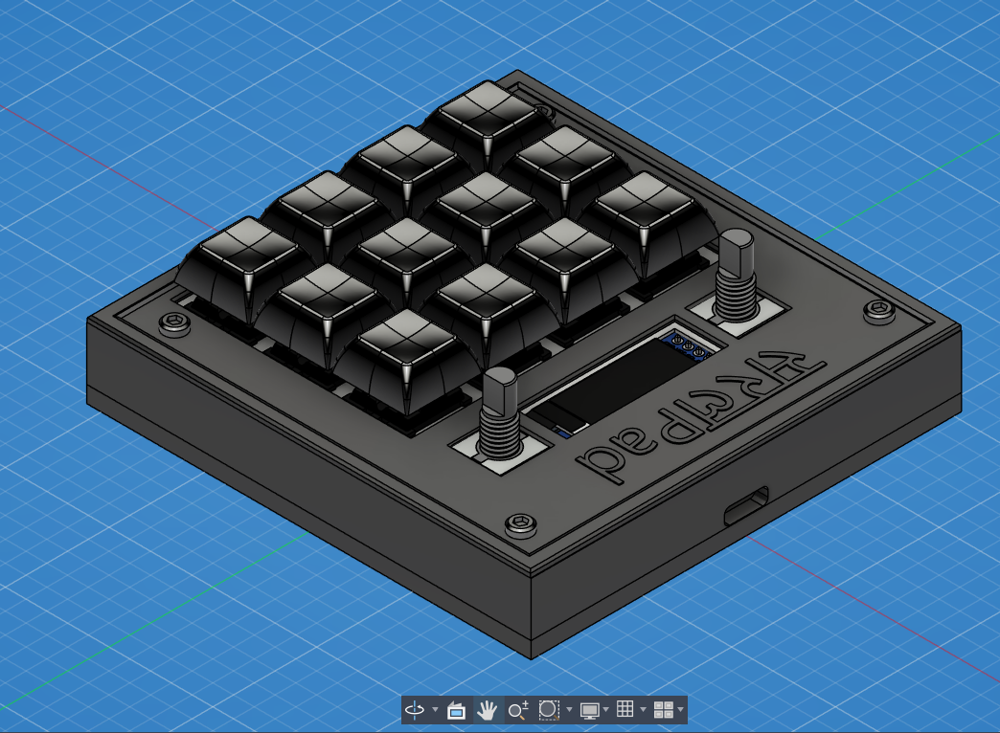

# SaralPad

SaralPad is a 12 key macropad with two rotary encoder, an OLED Display. It uses QMK firmware

It focuses on minimalism and ease of getting work done with as minimum clicks as possible. For this it uses 3 profile layer in firmware for normal, browser and coding use.

### Features:

 - Compact design but strong because of middleplate.
 - 128x32 OLED Display
 - EC11 Rotary encoder for whatever you want.
 - 12 Keys

### CAD Model:
Everything fits together using 4 M3 Bolts and heatset inserts.

It has 3 separate printed pieces. The backplate, the Middle plate to support pcb, and Top to cover electronics.

Made in Autodesk Fusion.

### PCB:
Here's my PCB! It was made in KiCad. 

### Firmware Overview:
Currently Firmware is underdevelopment so there is some time to finished product.
This Hackpad uses QMK Firmware for everything.
Features after completion:
 - Different key profile for different uses(Browsing, Coding, Gaming, and much more). 
 - One Rotatory encoder to change profile.
 - Oled Display to show key profile and different data about computer(Don't know if later is possible)

 I might add more in the future! That's it for now.

### BOM:
 - 12x Cherry MX Switches
 - 12x DSA Keycaps
 - 4x M3x5x4 Heatset inserts
 - 4x M3x16mm SHCS Bolts
 - 4x M3x16mm SHCS Bolts
 - 14x 1N4148 DO-35 Diodes.
 - 1x XIAO RP2040
 - 1x 0.91" 128x32 OLED Display
 - 2x EC11 Rotary Encoder
 - 1x Case (3 printed parts)
 - 1x PCB

 ### Extra Stuff:
 Learned few new things, realised I have short temper and I am quite dumb in some cases.
 Don't know what should I add more. 
 For future : I submitted this during war, I thought of not completing it as (not going to state as it is obvious), just tell   me my future-self :- Would you have regretted if hadn't submitted?? 
